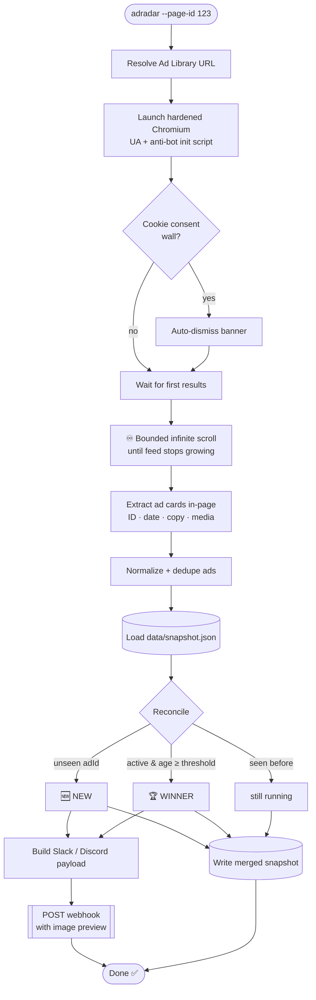

<div align="center">

# 📡 AdRadar

### Spy on your competitors' Meta ads on autopilot — and steal their winners.

**AdRadar** scrapes any advertiser's [Meta (Facebook) Ad Library](https://www.facebook.com/ads/library/) page, fingerprints every live creative, and tells you the two things that actually move your CAC:

> 🆕 **What's NEW** — the creative they launched this week.
> 🏆 **What's WINNING** — the creative that has been running for *weeks*, because nobody keeps paying to run a loser.

Brand-new and long-running ads are pushed straight to **Slack** or **Discord** with the copy, the start date, and an **image preview** — so your whole growth team sees them before your competitor's funnel out-converts yours.

[](https://github.com/NagaYu/AdRadar/actions/workflows/ci.yml)
[](#-project-status)
[](./LICENSE)
[](https://nodejs.org)
[](https://playwright.dev)
[](https://www.typescriptlang.org)
[](#-project-status)

<br/>



<sub>↑ a real run (replayed) — find competitors' new ads <strong>and</strong> the evergreen winners they keep paying to run.</sub>

</div>

---

## 🧪 Project status

> **AdRadar is `experimental` (v0.1).** Read this before you rely on it.
>
> - ✅ **The core logic is tested.** Snapshot diffing, new/winner detection, date parsing, and URL building are covered by **25 passing unit tests** (`npm test`) and the project typechecks under `strict` mode.
> - ✅ **The scraper has been validated end-to-end against the live Ad Library** (2026-06-29): a single run extracted 53 distinct ads — each with its Library ID, advertiser, body copy, image/video URL, and a correctly computed run-length — and a follow-up run correctly flagged the long-running ones as winners. Two real bugs were found and fixed in the process (hand-spoofed `Sec-Ch-Ua` client-hint headers blanked the page; a height-based card filter dropped virtualized/off-screen cards).
> - ⚠️ **Scraping is inherently brittle.** Meta's Ad Library is a heavily obfuscated, frequently-changing SPA. It can return zero results behind region/login gates, throttle datacenter IPs, or rename the text anchors the extractor relies on, **at any time and without notice**. A clean run today is not a guarantee for tomorrow — treat output as something to spot-check, not blindly trust.
> - 🩹 **Expect to maintain the selectors.** When Meta changes its DOM, update the regexes/anchors in `extractAds`, `dismissCookieBanner`, and `infiniteScroll`. This is the cost of scraping, not a bug.
> - 🧭 **First run tip:** start with `node dist/index.js --page-id <id> --no-headless --dry-run` so you can *watch* the browser and confirm cards are actually being extracted before wiring up webhooks.
>
> Contributions that harden the scraper against real-world DOM drift are especially welcome.

---

## 💡 Why "long-running ads" are a goldmine

Performance marketers kill ads that don't convert within **days**. Ad spend is brutally Darwinian.

So if a competitor has kept the *same* creative live for **2, 4, 8 weeks**, that is not an accident — it's a **public, audited signal that the ad is profitable.** They have already burned their budget testing it for you.

AdRadar turns that signal into a feed:

| Without AdRadar | With AdRadar |
| --- | --- |
| Manually open the Ad Library, squint, scroll forever | One command, fully automated |
| No idea when a creative launched | Exact "Started running on" date, tracked |
| "Is this ad doing well?" — you guess | "This ad has run **41 days** 🏆" — you *know* |
| You find their winner 3 months late | You get a Slack ping the day it crosses your threshold |

**Find the ad that's been running the longest. Model your next creative on it. Repeat.**

> ⚖️ **Use responsibly.** AdRadar reads the *public* Ad Library for competitive research. Respect Meta's Terms of Service, scrape at a polite cadence, and don't redistribute scraped media. You are responsible for how you use it.

---

## ✨ Features

- 🎭 **Hardened headless browser** — realistic User-Agent rotation, `navigator.webdriver` stripped, WebGL/plugin/locale spoofing, and a `--no-headless` mode to watch it work.
- 🍪 **Cookie-wall slayer** — auto-detects and dismisses Meta's GDPR consent dialog across multiple locales.
- ♾️ **Bounded infinite scroll** — exhausts the lazy-loaded feed and stops intelligently when the page stops growing.
- 🧠 **DOM-resilient extraction** — anchors on durable text ("Library ID", "Started running on") instead of Meta's rotating hashed class names.
- 🗂️ **File-based diffing** — a single `data/snapshot.json` per page tracks first-seen / last-seen / run-length. No database to run.
- 🆕🏆 **New + winner detection** — configurable winner threshold (default **7 days**).
- 🔔 **Rich notifications** — Slack **Block Kit** and Discord **Embeds**, with image previews and deep links into the Ad Library.
- 🤖 **CI-native** — one `npx adradar` line; ships with a copy-paste **GitHub Actions** daily cron.

---

## ⚡ 10-second quick start

```bash
# 1. Install deps and the Chromium Playwright needs
npm install
npx playwright install chromium

# 2. Build
npm run build

# 3. Point it at a competitor's Facebook page id (from their Ad Library URL)
node dist/index.js --page-id "123456789012345"
```

That's it. The first run seeds `data/snapshot.json` and reports everything currently live. **Every run after that only tells you what changed.**

Prefer to paste a full Ad Library URL? Do that instead:

```bash
node dist/index.js --url "https://www.facebook.com/ads/library/?active_status=active&ad_type=all&country=US&view_all_page_id=123456789012345"
```

### Wire up notifications

```bash
cp .env.example .env
# then edit .env:
#   SLACK_WEBHOOK_URL=https://hooks.slack.com/services/XXX/YYY/ZZZ
#   DISCORD_WEBHOOK_URL=https://discord.com/api/webhooks/XXX/YYY
```

Now every new ad and every newly-crowned winner lands in your channel automatically.

---

## 📟 Sample output

A real run against the live Ad Library (trimmed). **First run** seeds the snapshot and reports everything currently live:

```text
  ╔═══════════════════════════════════════╗
  ║          📡  A D R A D A R            ║
  ╚═══════════════════════════════════════╝
  Competitive Meta-ad radar · new & winner detection

▸ Scraping Meta Ad Library
  › First results rendered
  › Scroll pass 1/3 — height 5205 -> 7500, ~36 cards
  › Scroll pass 2/3 — height 7500 -> 9250, ~44 cards
  › Scroll pass 3/3 — height 9250 -> 10990, ~53 cards
  › Extracting ad cards from the DOM
  › Extracted 53 unique ad(s)
  ✓ Scraped 53 active ad(s) in 19.4s

▸ Reconciling against snapshot
  🆕 53 new  ·  🏆 0 winner(s)  ·  0 still running
    🆕 NEW Whatnot [1502078871070045] 227d
        “Yup, you can buy new outfits without breaking the bank. Save on fashion ⚡️ …”
        media: https://video.xx.fbcdn.net/o1/v/t2/f2/m412/AQPSgzJ9D0G8C_vmw8meoIzZY…
    🆕 NEW Nike [1016451784037642] 374d
        “Get the gear that goes hard on and off the field. NIKE.COM Nike Air Monarch …”
        media: https://scontent.xx.fbcdn.net/v/t39.35426-6/508595289_38944231908099…
```

The **next run** only surfaces what changed — and crowns the proven evergreens:

```text
▸ Reconciling against snapshot
  loaded 53 previously-tracked ad(s)
  🆕 0 new  ·  🏆 43 winner(s)  ·  1 still running
    🏆 WINNER Whatnot [1502078871070045] 227d
    🏆 WINNER Nike [1016451784037642] 374d
```

> Those `227d` / `374d` ads have been running for months — that's the public, audited signal that they convert. **Those are the creatives to study.**

---

## 🛰️ How it works



### The detection logic, precisely

- **New ad** → an `adId` present in this scrape that was **absent** from `snapshot.json`.
- **Winner** → an ad that is **still active** and whose age (from Meta's "Started running on" date, or first-seen date as a fallback) is **≥ `--winner-days`**, and which hasn't already been announced as a winner (so you're pinged exactly once when it crosses the line).

---

## 🛠️ CLI reference

```
adradar [options]

Options:
  -v, --version              print the AdRadar version
  -p, --page-id <id>         Facebook page id to monitor
  -u, --url <url>            full Ad Library URL (overrides --page-id)
  -c, --country <code>       Ad Library country filter (e.g. US, ALL)   (default "ALL")
  -d, --data <file>          path to the snapshot JSON          (default "data/snapshot.json")
  -w, --winner-days <n>      days running to qualify as a winner          (default "7")
  -s, --max-scrolls <n>      max infinite-scroll passes                   (default "40")
      --no-headless          run with a visible browser window
      --slack-webhook <url>  Slack incoming webhook (or SLACK_WEBHOOK_URL)
      --discord-webhook <url>Discord webhook (or DISCORD_WEBHOOK_URL)
      --dry-run              scrape & diff but send no notifications
      --timeout <ms>         per-navigation timeout in ms                 (default "60000")
  -q, --quiet                suppress progress chatter
  -h, --help                 display help
```

### Examples

```bash
# US-only ads, a stricter 14-day winner bar, watch the browser live
node dist/index.js --page-id 123456789012345 --country US --winner-days 14 --no-headless

# Track several competitors into separate snapshots
node dist/index.js -p 111111111 -d data/competitor-a.json
node dist/index.js -p 222222222 -d data/competitor-b.json

# First-run dry run: see what's live without spamming your channel
node dist/index.js -p 123456789012345 --dry-run
```

---

## 🤖 Daily auto-patrol with GitHub Actions

Drop this in `.github/workflows/adradar.yml` to sweep every competitor **every morning** and post to Slack/Discord — zero servers.

```yaml
name: AdRadar daily sweep

on:
  schedule:
    - cron: "0 8 * * *"   # 08:00 UTC every day
  workflow_dispatch: {}     # …or trigger it by hand

permissions:
  contents: write           # to commit the updated snapshot back

jobs:
  radar:
    runs-on: ubuntu-latest
    strategy:
      matrix:
        page: ["111111111", "222222222"]   # competitor page ids
    steps:
      - uses: actions/checkout@v4

      - uses: actions/setup-node@v4
        with:
          node-version: 20
          cache: npm

      - name: Install dependencies
        run: npm ci

      - name: Install Chromium
        run: npx playwright install --with-deps chromium

      - name: Build
        run: npm run build

      - name: Sweep ${{ matrix.page }}
        env:
          SLACK_WEBHOOK_URL: ${{ secrets.SLACK_WEBHOOK_URL }}
          DISCORD_WEBHOOK_URL: ${{ secrets.DISCORD_WEBHOOK_URL }}
        run: node dist/index.js --page-id "${{ matrix.page }}" --data "data/${{ matrix.page }}.json" --country US

      - name: Persist snapshot
        run: |
          git config user.name  "adradar-bot"
          git config user.email "adradar@users.noreply.github.com"
          git add data/*.json
          git commit -m "chore(adradar): update snapshot for ${{ matrix.page }}" || echo "no changes"
          git push
```

> Add your webhooks under **Repo → Settings → Secrets and variables → Actions** as `SLACK_WEBHOOK_URL` / `DISCORD_WEBHOOK_URL`. Committing the snapshot back is what lets the next day's run compute a real diff.

---

## 🗃️ Snapshot format

`data/snapshot.json` is a plain, human-readable file you can inspect and version:

```jsonc
{
  "version": 1,
  "pageId": "123456789012345",
  "updatedAt": "2026-06-28T08:00:12.481Z",
  "ads": {
    "987654321098765": {
      "adId": "987654321098765",
      "startedRunningRaw": "Started running on May 12, 2026",
      "startedRunningOn": "2026-05-12",
      "text": "Tired of bloated dashboards? Meet the analytics tool your team will actually open…",
      "media": [
        { "type": "image", "url": "https://scontent.xx.fbcdn.net/v/t45.../creative.jpg" }
      ],
      "pageName": "Acme Analytics",
      "adLibraryUrl": "https://www.facebook.com/ads/library/?id=987654321098765",
      "active": true,
      "firstSeenAt": "2026-05-13T08:00:09.114Z",
      "lastSeenAt": "2026-06-28T08:00:12.481Z",
      "seenCount": 47,
      "notifiedAsWinner": true
    }
  }
}
```

---

## 🧩 Project structure

```
AdRadar/
├── src/
│   ├── types.ts      # strict shared types (Ad, Snapshot, DiffResult, config…)
│   ├── scraper.ts    # Playwright crawler: stealth, scroll, DOM extraction
│   ├── storage.ts    # load/save snapshot + new/winner reconciliation
│   ├── notifier.ts   # Slack Block Kit + Discord Embeds over axios
│   └── index.ts      # commander CLI + colorette progress UI
├── data/             # snapshots live here (git-ignored)
├── package.json
├── tsconfig.json     # strict: true, ES2022
├── .env.example
├── .gitignore
├── LICENSE
└── README.md
```

---

## 🩺 Troubleshooting

| Symptom | Fix |
| --- | --- |
| `0 active ads found` | Run with `--no-headless` to watch. The page may be region-gated — try `--country US`. The page id may have no live ads. |
| Browser won't launch in CI | Use `npx playwright install --with-deps chromium` (the `--with-deps` pulls the Linux libs). |
| Cookie wall not dismissed | Add your locale's button label to the `candidates` list in `src/scraper.ts → dismissCookieBanner`. |
| Notifications never arrive | Confirm the webhook env vars are set (`--dry-run` off), and check the printed `✗` error line for the HTTP status. |
| Meta changed the DOM | Extraction anchors on text, not classes — but if Meta renames "Library ID" / "Started running on", update the regexes in `extractAds`. |

---

## 🗺️ Roadmap

- [ ] Headful "persistent context" mode for logged-in libraries
- [ ] Per-ad creative diffing (detect when they swap the image but keep the ad)
- [ ] CSV / Google Sheets export
- [ ] Telegram & Microsoft Teams transports
- [ ] Optional local download + archive of winning creatives

PRs welcome. ⭐ the repo if AdRadar finds you a winner.

---

## ⚖️ Legal & responsible use

AdRadar is an educational / competitive-research tool that reads the **public** Meta Ad Library. Before you run it, understand:

- **Scraping may conflict with Meta's Terms of Service.** Automated access to Facebook properties can violate their ToS regardless of the data being public. You are solely responsible for ensuring your use is lawful in your jurisdiction and compliant with Meta's terms.
- **Scrape politely.** Use the daily cron, not a tight loop. Hammering the Ad Library is both rude and a fast way to get blocked.
- **Don't redistribute scraped creatives.** Ad copy and media belong to their advertisers. AdRadar is for *intelligence*, not republication.
- **No warranty.** This software is provided "as is" (see the MIT terms). The maintainers are not liable for account actions, blocks, or any consequences of use.

If you represent Meta and would like a usage adjustment, please open an issue.

---

## 📜 License

Released under the [MIT License](./LICENSE). © 2026 AdRadar contributors.

<div align="center">

**Built for growth hackers who'd rather copy a proven winner than gamble on a guess.**

</div>
